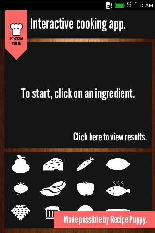
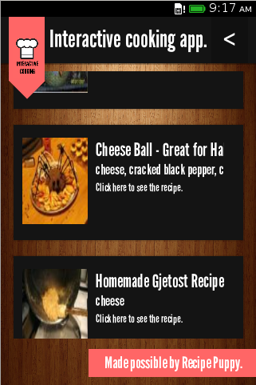

FirefoxOS-recipes-application
=============================

An recipes application written for FirefoxOS. Developed using HTML5 and Javascript.

The application is in the Firefox Marketplace at https://marketplace.firefox.com/app/recipes.

Development
-----------

The application is written using HTML, JavaScript and jQuery. To get the recipes list, the Recipe Puppy
public API is used. Also, Hammer.js is used to detect user swipes (currently not supported on FirefoxOS,
but works on desktop browsers).

Screenshots
-----------

